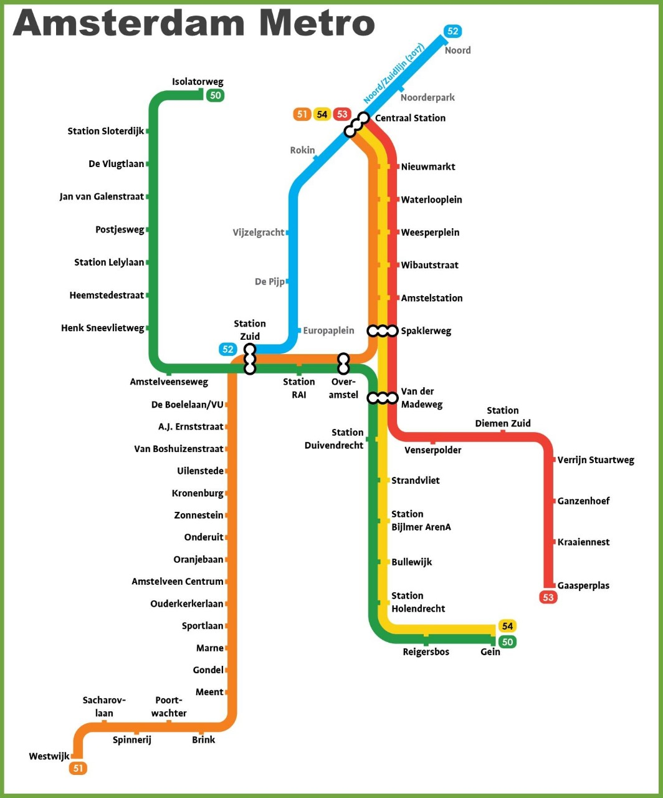

# Task 1



Трохи його перевернуло =(

# Task 2. Висновки
```
Шляхи з використанням DFS: [
        ['gein', 'van_der_madeweg', 'spaklerweg', 'over_amstel', 'station_zuid', 'central_station', 'noord'], 
        ['gein', 'van_der_madeweg', 'spaklerweg', 'central_station', 'noord'], 
        ['gein', 'van_der_madeweg', 'over_amstel', 'station_zuid', 'central_station', 'noord'], 
        ['gein', 'van_der_madeweg', 'over_amstel', 'spaklerweg', 'central_station', 'noord'],
    ]
    Шляхи з використанням BFS: [
        ['gein', 'van_der_madeweg', 'spaklerweg', 'over_amstel', 'station_zuid', 'central_station', 'noord'],
        ['gein', 'van_der_madeweg', 'spaklerweg', 'central_station', 'noord'], 
        ['gein', 'van_der_madeweg', 'over_amstel', 'station_zuid', 'central_station', 'noord'], 
        ['gein', 'van_der_madeweg', 'over_amstel', 'spaklerweg', 'central_station', 'noord'], 
    ]
``` 
DFS просувається на глибину, відвідуючи всі можливі вершини, поки не досягне кінцевої вершини або поки не вичерпає всі можливі шляхи. 

BFS просувається на один рівень за раз, обходячи всі сусідні вершини на кожному рівні перед переходом до наступного рівня. 

Отже, різниця в отриманих шляхах полягає в стратегії обходу графа. 
DFS може знаходити довші шляхи, які пролягають через більш глибокі рівні графа, 
тоді як BFS зазвичай знаходить найкоротший шлях до цільової вершини, оскільки він просувається на один рівень за раз.

P.S.
на нашому графі, різницю між dfs і bfs буде важко розрінити.
